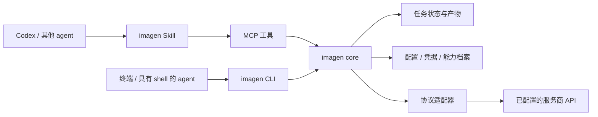

# imagen 开发计划

日期：2026-09-07
状态：v0.1.0 核心、SDK 适配、CLI、MCP 和标准包已实现，已完成主要真实 API 联调；客户端与发行验收见 [验证记录](validation.md)。

## 1. 目标与范围

将 imagen 做成采用 MIT 许可证公开开源、可用于 Codex 及其他 agent 的图片生成、图片编辑工具。主要交付物采用 Agent Plugins 1.0.0，包含一个 imagen Skill 和本地 stdio MCP 服务；CLI 与 MCP 共享独立的 API 调用核心。

完整交付范围包括四类适配目标：Images API、Responses API、Gemini Developer API，以及 Vertex 平台上的图片调用。每种接口按具体服务商和模型声明能力，支持自定义服务端点。

用户可观察到的核心流程：

1. 配置服务商、认证和模型后，使用自然语言或 CLI 生成图片，得到可打开的文件。
2. 使用一张或多张参考图进行生成或编辑；模型支持时使用 mask。
3. 切换已配置的服务商或模型，保持相同的工具入口与结果结构。
4. 查询耗时任务的状态、获取结果、请求取消；遇到失败时知道是否可能已经提交或计费。
5. 在 Codex 和 VS Code 中的 GitHub Copilot 完成安装、生成、编辑和结果展示。

首版暂不包含：图形化配置后台、公共云服务、视频生成、模型训练、自动选择最低价格模型、任意代码形式的用户适配器。远程 Streamable HTTP 服务作为后续扩展。内置 imagegen 的自动路由与宿主指令优先级不由插件控制，验收以 imagen 自己的可调用工作流为准。

## 2. 已确定的方向与默认技术选择

| 项目 | 决定 | 原因 |
| --- | --- | --- |
| 主包格式 | Agent Plugins 1.0.0 | 将 Skill 与 MCP 作为可移植组件发布 |
| Skill | 一个薄 Skill | 负责工作流，不包含各服务商的 HTTP 拼装逻辑 |
| 核心 | 与客户端无关的 TypeScript 库 | CLI、MCP 与未来其他接入方式复用 |
| 运行时 | Node.js 24 LTS，发布时固定经过测试的 patch | 已有本地运行环境，避免同时维护多种语言运行时 |
| MCP | 官方 TypeScript SDK 的稳定版本；P0 锁定具体依赖 | 使用标准协议实现，单独验证客户端协议协商 |
| OpenAI API | Images / Responses 优先使用官方 TypeScript SDK：`openai` | 复用请求序列化、文件上传、流式解析和错误类型 |
| Google API | 优先使用官方 Google Gen AI SDK：`@google/genai` | Gemini Developer API 与 Vertex 共用 SDK，减少请求编码、端点和认证维护 |
| 通用 HTTP | 用于图片下载，以及有明确依据的 SDK 能力缺口 | 四类 API 的常规调用均优先使用官方 SDK |
| 仓库 | 单仓库、单 npm package（`@wdd817/imagen`），按源码目录分层 | 当前规模不需要 monorepo 或独立部署服务 |
| 测试 | 离线契约测试为主，真实生图为显式联调 | 正常开发不依赖付费 API |

以上技术栈属于本计划的默认选择，可以在 P0 调整而不改变交付目标。当前机器检测到 Node v24.13.0、npm 11.6.2、Codex CLI 0.153.4；这些只证明工具存在，不代表 imagen 已兼容该客户端。

截至本次核查，Node 24 属于 LTS；官方 MCP TypeScript SDK v2 文档提供当前服务端开发入口。具体版本在实现时再次核对并锁定，不直接追踪浮动的 latest。[Node 发行状态](https://nodejs.org/en/about/previous-releases)、[MCP TypeScript SDK](https://ts.sdk.modelcontextprotocol.io/v2/)

## 3. 架构与模块边界



源码计划布局：

```text
imagen/
  docs/development-plan.md
  package.json
  src/
    core/           # 请求、能力校验、任务执行和公共错误
    config/         # 配置版本、profile 和凭据读取
    adapters/       # 统一业务请求与 SDK / HTTP 调用之间的映射
      openai/       # 共享 SDK client factory，Images / Responses 能力映射
      google/       # 共享 SDK client factory，Gemini / Imagen 能力映射
    jobs/           # 状态、并发控制、恢复与取消
    artifacts/      # 图片检查、文件保存、结果元数据
    cli/            # 命令行入口
    mcp/            # 工具声明与 MCP 结果封装
  plugin/           # 标准 manifest、MCP 配置、Skill 的源文件
  scripts/          # 构建、打包与规范校验
  tests/            # 单元、fixture、集成与客户端验收
  dist/imagen/      # 构建生成的可分发标准包
```

发布包内部固定为：

```text
imagen/
  plugin.json
  mcp.json
  skills/imagen/SKILL.md
  runtime/          # 构建后的 MCP / CLI 和所需运行依赖
  LICENSE           # MIT 许可证正文；版权署名 wdd817
```

`runtime/` 是 imagen 自己的实现目录。标准通过根目录清单、`skills/` 和 `mcp.json` 发现组件；清单与 MCP 文件使用匹配的规范版本。[Agent Plugins 打包](https://agent-plugins.org/plugin-authors/build-an-agent-plugin)、[Manifest](https://agent-plugins.org/plugin-authors/manifest)

不手工维护多套核心源码。目标客户端若确实需要原生包装，构建脚本从同一来源生成独立兼容包；避免一个安装同时注册两套同名 Skill 或 MCP 工具。

## 4. API 适配模型

将以下维度分开，避免把一个 `api_type` 同时当作平台、认证和模型能力：

| 维度 | 示例 | 所属层 |
| --- | --- | --- |
| 服务商 profile | 一个官方网关或第三方网关实例 | 用户配置 |
| 平台与端点 | 通用 endpoint、Gemini Developer、Vertex project/location | 连接配置 |
| 请求协议 | images、responses、generate-content、predict | adapter |
| 认证 | API key、Bearer、Google 凭据链等 | auth resolver |
| 模型 | 实际模型 ID、必要时单独的图像工具模型 | profile / 调用参数 |
| 能力 | 生成、编辑、参考图、mask、数量、尺寸、格式 | 能力档案 |

能力状态至少区分 `supported`、`unsupported`、`unknown`，并记录依据：官方文档、供应商声明或已验证样例。未知能力不自动当作支持。配置检查默认不发起生图探测，也不以模型列表接口成功作为生图能力证明。

| 适配目标 | 基础范围 | 重点差异与验收要求 |
| --- | --- | --- |
| Images API | 使用 `openai` SDK 的 `images.generate` / `images.edit`；mask 等按模型能力 | SDK 处理 JSON / multipart 与文件上传；imagen 归一化 base64 / URL 结果并校验能力 |
| Responses API | 使用 `openai` SDK 的 `responses.create` 调用 image_generation 工具 | 区分主模型与图像工具模型，解析全部图像工具结果；普通文本不算图片成功 |
| Gemini Developer API | 使用 `@google/genai` 的 `models.generateContent` 调用支持图片的 Gemini 模型 | 映射混合文本/图片 parts、输出配置与连续编辑上下文；SDK 处理请求编码 |
| Vertex 平台 | 同一 SDK 下分别使用 Gemini `generateContent`、Imagen `generateImages` / 支持时的 `editImage` | 平台、project/location 和凭据显式配置；Gemini 与 Imagen 分别声明能力和联调 |

OpenAI 官方图像入口包括 Images 和 Responses。Google 的平台和协议可以共享部分实现，但保留平台配置与模型差异。[OpenAI 图片生成](https://developers.openai.com/api/docs/guides/image-generation)、[Google 平台比较](https://ai.google.dev/gemini-api/docs/migrate-to-cloud)

适配器扩展约定：

- 使用上述图片接口的兼容服务可只增加 endpoint、model 和能力 profile；同一接口的供应商响应差异通过可测试的解析器适配。
- `providerOptions` 使用对应适配器的 schema；不提供任意 JavaScript、shell 模板或任意响应求值表达式。
- 未支持的关键参数在提交前报错，不能默默丢弃 mask、参考图或尺寸要求。
- 生成、参考图引导、指令编辑与局部 mask 编辑分别声明；不承诺未编辑区域逐像素不变。
- 连续编辑使用同一 provider 的上下文时，保存其必要的 opaque 状态；切换 provider 时按重新提交参考图处理，不转用另一家的 response ID 或私有状态。

### SDK 共用维护原则

四类适配目标均优先采用现成的官方 SDK。SDK 负责常规协议和传输，imagen 保留公共接口、能力校验、任务执行与产物处理。SDK 类型隔离在对应 adapter 内，不暴露给 CLI、MCP 或 core。

- 在 P0 锁定 `openai` 与 `@google/genai` 的精确版本，验证 Node 24、配置注入、取消、重试和独立打包。升级时复用既有契约测试与有限真实联调。
- 自定义 endpoint 先通过 SDK 的公开配置验证。只有实际需求超出锁定 SDK 的覆盖范围时，才增加局部 HTTP 例外，并记录原因、测试及撤销条件。
- SDK / HTTP 路径在提交前选定。不能在超时或结果未知后自动换路径重新生成。
- 使用窄接口替身测试 imagen 的参数映射；使用真实 SDK 对本地 HTTP 假服务验证序列化、请求次数与错误处理，避免复制 SDK 内部测试。

### OpenAI SDK 接入策略

Images 和 Responses 共用官方 `openai` SDK 的客户端创建逻辑，分别映射生成/编辑请求与图像工具请求。官方示例已覆盖 `images.generate`、`images.edit` 和 `responses.create`；图片能力仍按具体模型校验。[OpenAI TypeScript SDK](https://developers.openai.com/api/reference/typescript)、[图像生成与编辑](https://developers.openai.com/api/docs/guides/image-generation)

- 显式传入当前 profile 的 `apiKey` 和 `baseURL`，避免读取未选择的环境配置；第三方兼容 endpoint 按真实支持能力验收，SDK 能连接不代表所有参数可用。
- 生成请求显式设置 `maxRetries: 0`，以毫秒配置 timeout；P0 核对锁定 SDK 的请求选项类型并测试取消信号传入。请求中止不代表远端撤销，不与 Google 的重试参数混用。
- 显式设置 SDK `logLevel: 'off'`，通过 imagen 的受控 stderr 日志输出脱敏诊断，避免环境中的 debug 配置泄露提示词、图片内容或污染 MCP 输出。
- 图片与 mask 上传使用 SDK 支持的文件对象、流或上传辅助方法，由 SDK 生成 multipart；编辑目标和参考图的语义及顺序由 imagen adapter 映射。
- Responses adapter 遍历 output 中的图像生成结果，处理多图、非完成状态和可恢复的 response ID。仅返回 `output_text` 不能判定生图成功；SDK 异常转换为公共错误时保留可用的请求 ID 和状态信息。

### Google SDK 接入策略

Google 侧优先使用 `@google/genai`，以同一个 client factory 配置 Gemini Developer API 和 Vertex 的客户端实例。SDK 提供 `generateContent`、`generateImages`、`editImage` 等入口，具体可用能力仍由所选平台和模型决定。[Google Gen AI SDK](https://github.com/googleapis/js-genai)、[SDK Models 接口](https://googleapis.github.io/js-genai/release_docs/classes/models.Models.html)

- imagen 的 Google adapter 只承担公共请求到 SDK 参数的映射、模型能力校验、图片结果归一化及公共错误转换；端点构造、协议序列化和受支持的认证交给 SDK 及其官方认证依赖。
- Gemini 与 Imagen 共用客户端初始化，分别维护能力 mapper，避免重复封装整套 SDK。
- 将 profile 的平台、API key / `googleAuthOptions`、`baseUrl` 和 API version 显式映射到 SDK 配置；平台选择字段的 SDK 命名变化只在 client factory 内处理。测试最终 URL，避免版本或 project/location 路径被重复拼接。[客户端配置](https://googleapis.github.io/js-genai/release_docs/interfaces/client.GoogleGenAIOptions.html)、[HTTP 配置](https://googleapis.github.io/js-genai/release_docs/interfaces/types.HttpOptions.html)
- 按锁定版本验证生成调用的 `httpOptions.retryOptions.attempts: 1`，只允许一次提交；将 core 的取消信号传入 `config.abortSignal`，HTTP timeout 使用毫秒。取消只终止本地等待，不作为远端撤销证明。[重试配置](https://googleapis.github.io/js-genai/release_docs/interfaces/types.HttpRetryOptions.html)、[生成配置](https://googleapis.github.io/js-genai/release_docs/interfaces/types.GenerateContentConfig.html)

## 5. 公共接口、任务与结果

P0 固定第一版公共 schema，之后所有适配器接受同一种语义请求：

- 请求：`requestId`、`operation`、`prompt`、`profile`、可选 `model`、编辑目标 `targetImage`、参考图 `referenceImages[]`、可选 `mask`、输出要求、`outputDir`、超时和经过校验的 `providerOptions`。
- `targetImage` 与 `referenceImages` 保留不同语义；edit 必须有目标图片，mask 与目标关联，由适配器明确映射图片顺序。`requestId` 由调用端生成并用于重试识别，`jobId` 由 core 返回；相同 requestId 配不同请求内容时报冲突。
- 图片输入以本地绝对路径为首版基础；URL / data URL 输入通过显式类型扩展，不混用字符串含义。
- 结果：`jobId`、状态、服务商/model、图片数组、可选文本、可选 usage、告警及恢复信息。
- 每张图片返回实际 MIME、可读文件路径、可确定的尺寸与字节数。usage 缺失表示未知；不伪造 token 数或价格。

计划中的入口：

| 入口 | 行为 |
| --- | --- |
| `imagen generate` / `imagen edit` | CLI 前台执行并等待结果；支持机器可读 JSON 输出 |
| `imagen configure` | 创建或修改指定路径的本地配置，凭据交互不进入命令历史 |
| `imagen doctor` / `imagen capabilities` | 检查安装与配置，列出能力；网络探测需显式开启 |
| `imagen mcp` | 启动本地 stdio 服务 |
| MCP `imagen_generate` / `imagen_edit` | 提交任务并快速返回 jobId，不占用一次工具调用等待整次生图 |
| MCP `imagen_job` | 查询状态、读取已完成的图片和结果 |
| MCP `imagen_cancel` | 请求停止本地等待；远端取消能力单独返回 |
| MCP `imagen_capabilities` | 返回已配置 profile 的能力与必要限制 |

任务状态包括 queued、running、succeeded、failed、cancelled、unknown。业务状态由 core 管理，不依赖某个客户端的实验性 MCP 长任务扩展。服务进程存活时推进任务；首版不额外启动系统守护进程，也不承诺宿主退出后继续执行。

执行规则：

1. 提交前保存 jobId、配置指纹及输出位置；每个任务以原子写入记录状态，同一数据目录的多进程不能重复领取任务。
2. 客户端使用同一请求标识重查已存在任务时返回原任务，不重复生成；用户明确要求再生成时创建新请求。
3. 默认有限并发和队列上限；每项任务可以配置总超时，支持停止等待。
4. 网络中断或超时后，如无法确认远端是否已接收，状态设为 unknown；仅在供应商提供可靠幂等或恢复机制时自动恢复提交。
5. 可重试的只读查询与可明确证明未提交的失败使用有界退避；429/5xx 本身不能无条件证明生图请求尚未执行。
6. 取消本地任务不等于远端取消或退款；已经返回的 provider job ID 用于实际支持的查询和取消。
7. 进程重启后重读记录；曾运行的任务只有可验证恢复路径才继续查询，否则保持 unknown，不能自动重放。
8. 远端已成功但本地写图失败时单独报告保存失败，并保留可恢复的结果引用；恢复保存不重新生图。

关闭所用 SDK 对生成请求的隐式自动重试。下载失败只重试下载，局部结果可恢复时不重做整个任务；不确定是否已提交时不自动切换供应商、模型或协议。请求标识去重限于同一状态目录与保留期，不承诺跨客户端安装的全局 exactly-once。

图片处理校验 MIME 与实际内容，限制下载体积和重定向，下载时不向图片域名附带供应商 API 凭据。输出采用临时文件加原子落盘，默认不覆盖已有文件；一次请求返回多图时明确部分成功情况。

MCP 返回结构化结果，并在客户端支持时附带图片内容或预览。完整图片保存到可访问的位置；预览大小受控，不能把大段 base64 混入文字日志。stdio 的 stdout 只写协议消息，日志走 stderr。

## 6. 配置、凭据和跨客户端路径

profile 配置包括配置版本、默认模型、平台参数、认证引用、能力档案及适配器参数。CLI 通过 `--config` 指定配置路径；MCP 默认使用其客户端分配的数据目录。可显式选择同一外部配置文件进行复用，但不默认扫描其他客户端的配置或密钥。

CLI 的任务与缓存目录通过 `--data-dir` 指定，缺省使用用户专用的 imagen 数据目录；MCP 使用 `PLUGIN_DATA` 下的对应目录。希望 CLI 查询某个 MCP 实例任务时，必须选择该实例实际的数据路径，共享 profile 不代表共享任务状态。

P0 固定以下存储契约：CLI 的 `--data-dir` 或默认目录作为 stateRoot，MCP 的 stateRoot 为 `PLUGIN_DATA/imagen`。默认配置为 `stateRoot/config.json`，API key 凭据为 `stateRoot/credentials.json`，任务位于 `stateRoot/jobs/`，缓存位于 `stateRoot/cache/`。`--config` 只改变配置文件位置，不暗中改变任务目录。凭据引用通过类型和文件路径解析，配置命令以隐藏输入录入 API key，原子写入并检查文件访问权限。

- `PLUGIN_ROOT` 用于读取包内运行代码；`PLUGIN_DATA` 用于本插件实例的配置、任务记录与缓存，并编写带备份的配置迁移。
- 标准不保证继承任意宿主环境变量。直接 CLI 可显式使用环境变量认证；Plugin 环境使用已配置的凭据文件/凭据读取方式，宿主注入仅作为经过验证的接入选项。
- 不在 plugin.json、mcp.json、Skill、测试 fixture 或发行包中写入密钥。工具参数使用 profile 名称，不要求 agent 逐次传入 API key。
- 首版 API key 使用用户专用凭据文件并与普通 profile 分离，配置命令检查相应 OS 的文件访问权限；Google 凭据按所选官方认证流程保存和刷新。系统密钥库支持可以后续增加，不作为首版隐含依赖。
- Google 认证首版支持已验证模型可用的 API key 模式，以及显式选择的 Google 用户或服务账号凭据文件；通过 `@google/genai` 的客户端认证配置及其官方认证依赖注入、解析和刷新。不默认搜索未配置的全局 ADC 文件或依赖环境变量发现文件，具体认证方式不由平台名称硬编码决定。
- 首次配置缺失时返回需要设置的字段和实际配置位置；用户通过本地配置命令录入凭据。doctor 隐去凭据和完整认证响应。
- MCP 由调用参数显式获得绝对 `outputDir` 与参考图路径；不能把默认工作目录当作用户项目。CLI 可相对于用户运行命令时的目录解析路径，再传给 core。
- 产物保存到用户指定的目录；插件缓存只存放必要的中间结果和任务状态，提供清理方式。

标准只规定插件变量与有限的运行配置，不统一供应商密钥或远程 MCP 登录方案；包目录约束也不意味着输出必须写入插件目录。[MCP 配置规范](https://agent-plugins.org/plugin-authors/mcp-servers)、[MCP 运行环境](https://agent-plugins.org/client-implementers/mcp-runtime)

## 7. 标准包、Skill 与运行时交付

标准包以已经构建的 JavaScript 和运行依赖发布。第一版要求 Node 24 LTS 可执行文件可用；MCP 入口使用单一 `node` 命令与独立 args，不依赖 Bash、PowerShell 字符串拼接或当前仓库位置。

P0 验证打包策略：优先把纯 JavaScript 依赖打入运行产物；无法打入的必要依赖随包固定，包括 `openai`、`@google/genai` 及实际使用的认证依赖。消费者不需要 TypeScript 工具链或源码目录，也不在第一次调用时隐式运行 npx 下载 latest 或执行 npm install。Node 不可用时给出明确安装诊断；跨平台自带 Node 二进制不作为首版前提。

Skill 只包括调用步骤、生成与编辑判断、获取绝对输入/输出路径、查询任务和展示结果。描述中允许正常自动发现，同时支持显式调用。宿主特定的展示方式放在对应说明中，不把 Codex 专属工具名写成所有 agent 的必需依赖。

无凭据时 MCP 仍应完成初始化并列出工具，实际生图调用才返回配置缺失；初始化过程中不连接图像 API。断开或取消时清理本地请求和临时资源，不把失去远端状态的任务伪装为成功或未提交。

验收包需复制到全新的含空格和中文路径中启动，并模拟只读插件目录、空的用户数据目录以及升级后旧数据保留。Windows 为本地优先验收平台；Linux/macOS 在可用 CI 或目标环境中验证后才声明支持。

原位升级与卸载重装分开验收。标准允许卸载时删除插件数据，因此提供配置导出/导入流程：默认只导出非敏感 profile，凭据重新配置或显式引用用户保留的凭据文件，任务历史不承诺经卸载保留。

Agent Plugins 的客户端支持不等于统一安装、权限或图片展示。Codex 官方 marketplace 已支持引用 Agent Plugins 1.0 包；首版使用本地安装联调，公开发布和市场上架单独进行。[兼容客户端](https://agent-plugins.org/compatible-clients)、[Codex 插件管理](https://learn.chatgpt.com/docs/enterprise/plugin-management)

### npm 与标准插件双渠道分发

用户已确定同时发布 npm 公共包 `@wdd817/imagen`，发布账号为 `wdd817`。npm 包提供 `imagen` CLI 与本地 MCP 服务入口；Agent Plugins 的插件名称保持 `imagen`，标准包继续包含 Skill 和 MCP 接入配置。两种产物由同一份源码构建，保持版本一致；npm 的作用域包名不用于标准插件的 name 字段。

npm 以已确认的 `@wdd817/imagen` 配置包名，声明 public 发布访问级别，配置 `imagen` bin 入口和发布文件白名单；通过 `npm pack` 检查并在独立目录安装实际 tarball，验证 CLI 与 MCP 可运行、依赖完整且未夹带凭据或本地配置。发布说明给出明确版本的安装与 MCP 启动方式。用户显式通过 npm 获取工具，不改变标准插件默认启动本地构建入口的约定。

### 标准插件包接入（独立于 npm）

以下标准包分发方式继续保留，可独立完成 VS Code + GitHub Copilot 验收：

1. 将构建后的 `dist/imagen/` 打包为版本化 GitHub Release 资产，包含完整标准包和运行依赖；用户安装 Node 24 后下载并解压。GitHub 自动生成的源码压缩包不作为可运行插件包。
2. VS Code 开启 `chat.plugins.enabled`，通过 `chat.pluginLocations` 注册解压后的插件根目录。目录中的 Skill 与 MCP 按插件机制加载；开发测试可直接注册本机 `dist/imagen/`。[VS Code 本地插件](https://code.visualstudio.com/docs/agent-customization/agent-plugins#use-local-plugins)、[相关设置](https://code.visualstudio.com/docs/agents/reference/ai-settings)
3. 对只接 MCP 的客户端，提供原生 MCP 配置，直接以 Node 启动本地构建入口，并显式传入数据目录。此路径不会自动安装 Skill，也不依赖插件变量注入；按宿主规则另行安装 Skill，避免与标准插件重复注册。[VS Code MCP 配置](https://code.visualstudio.com/docs/agents/reference/mcp-configuration)

VS Code 还支持从 Git 源安装插件，但所选插件目录必须包含可运行的构建产物。若采用该渠道，另行确定发布目录或分支；不假设客户端会对当前源码仓库自动执行依赖安装与构建。本地目录安装的版本更新通过替换构建产物并重新加载验证。[从 Git 源安装](https://code.visualstudio.com/docs/agent-customization/agent-plugins#install-a-plugin-from-source)

## 8. 里程碑与交付门槛

按依赖推进，不预设未经验证的日历日期。MVP 是阶段性交付，不代表全部 API 支持已经完成。

真实联调是对应阶段退出的证据；凭据或账号暂缺时，仅暂缓该退出判定，仍可继续依赖稳定公共契约的离线开发。

| 阶段 | 依赖 | 主要工作与交付物 | 退出条件 |
| --- | --- | --- | --- |
| P0：契约与工程骨架 | 无 | 固定公共 schema 与存储契约；锁定依赖并验证 OpenAI / Google SDK 配置、重试与打包；mock adapter；标准包校验 | 脱离源码的产物能在本机启动 MCP 握手；无密钥也能运行离线测试 |
| P1：第一条真实图片链路 | P0 | 基于 `openai` 的共享 client factory 与 Images adapter；core、CLI、配置、产物保存、任务错误语义 | CLI 用已选 endpoint/model 生成并编辑真实图片；离线覆盖主要失败与保存分支 |
| P2：可安装的 MVP 0.1 | P1 | 基于 `@google/genai` 的共享 client factory 与 Gemini adapter；本地 MCP 任务接口、薄 Skill、标准包 | Codex 完成生成→查询→展示→编辑；Images 与 Gemini 各有可验证样例；原位升级保留配置，卸载重装可导入恢复 profile |
| P3：原生协议与平台扩展 | P2 | 复用 `openai` SDK 接入 Responses；复用 Google SDK 接入 Vertex Gemini / Imagen；补齐 profile、能力 mapper 与认证 | 每条已声明路径有契约测试与对应联调证据；认证失效、参考图和平台差异得到验证 |
| P4：完整范围发布候选 | P2–P3 | VS Code + GitHub Copilot 实测、标准插件与 npm tarball 打包/安装验证、升级与故障恢复回归、文档、支持矩阵 | 四类目标状态明确；两客户端验收完成；npm 安装后的 CLI/MCP 可用，两类发布包可复现，待定项不得写成通过 |

首个联调平台已确定为 Example API。用户确认可用的路径为 Gemini API 与 Responses API；P1 将优先从这两条已具备访问条件的路径中选择，依据 SDK 接入验证确定具体顺序，并同步调整 P1–P3 的适配器安排。用户目前只能提供服务根地址，文档不作为规划或工程骨架开发的前置条件。表中的 Images 优先顺序作为初始安排，不要求为保持该顺序另行开通账号。四类适配目标均保留在完整交付范围。

接口冻结后可并行开展 Responses 适配、Google 平台适配、Skill/打包验收；公共 schema 和任务执行核心集中维护，避免多条分支各自修改接口。

## 9. 测试与完成标准

测试不比较某张生成图片的像素是否每次相同。离线测试验证请求语义、响应解析、状态恢复与产物行为；真实图片质量由有限的典型案例人工或视觉检查。

| 测试层 | 必测内容 | 通过证据 |
| --- | --- | --- |
| 配置与能力 | 错误 profile、模型能力 unknown/unsupported、非法关键参数、凭据缺失 | 提交前给出可操作错误，未发出付费请求 |
| Adapter 契约 | 正常图片、混合文本/图片、纯文本、URL/base64、multipart、拒绝/限流/错误体 | 脱敏 fixture 与本地 HTTP 测试；各协议结果归一化一致 |
| OpenAI SDK 集成 | Images 生成/编辑、multipart、Responses 图像工具结果、baseURL、显式认证、取消、`maxRetries: 0` | 使用锁定 SDK 对假服务验证；超时或5xx不会自动重复提交生成请求 |
| Google SDK 集成 | 参数/返回值映射、两种平台初始化、认证、API version、endpoint、取消、重试次数 | 使用锁定 SDK 对假服务验证；不确定提交结果不会自动重复生图 |
| 任务行为 | 重复请求标识、并发、取消、超时、断流、服务重启、保存失败 | 无不可解释的重复提交，unknown 可辨识且有恢复路径说明 |
| 文件与输入 | 中文/空格路径、相对路径解析、无效图片、mask、URL下载、文件重名 | 文件可打开，不损坏旧文件，失败不会被报告为成功 |
| MCP | 握手、工具 schema、状态查询、structured result、stdout 纯净 | 真实 SDK client 通过子进程连接构建后的产物 |
| 标准包 | 两个官方 schema、组件发现、依赖完整性、包外引用、配置升级 | 从独立目录启动，不借用源码与开发 node_modules |
| 客户端 | 安装、发现 Skill/工具、生成、编辑、图片展示、配置留存 | 记录客户端/OS/版本、复现步骤和产物 |
| 真实 API | 每个声明支持的 endpoint/model 与能力组合 | 记录请求 ID、脱敏参数、日期、产物和实际能力 |

真实 API 联调使用指定 profile，按功能验收和故障定位需要安排调用；用户明确不考虑联调费用消耗，不设置金额或积分预算上限，也不因费用另行请求确认。开发测试默认走 mock，重试仍遵守任务状态和幂等规则。尚无实际账号、服务商样例或目标客户端时，继续完成离线工作，将对应验收标为“待联调”，不以 mock 通过替代真实兼容声明。

发布候选必须同时满足：

- [ ] 标准包和运行依赖可在独立目录使用；没有开发机绝对路径和密钥。
- [ ] npm 公共包的名称、发布账号与版本已确定；实际 tarball 通过文件清单检查及独立安装测试，CLI/MCP 入口可运行。
- [ ] CLI 与 MCP 调用同一个 core，返回一致的任务和图片信息。
- [ ] Images / Responses 使用锁定版本的 `openai`，Google 常规调用使用锁定版本的 `@google/genai`；SDK 依赖随包可用，HTTP 例外有明确依据和独立测试。
- [ ] 四类适配目标全部有实现或清晰的实际能力状态；完整支持范围内的路径完成联调。
- [ ] 生成、编辑、参考图、mask 等每项能力有单独声明与验证记录。
- [ ] 不确定提交结果、重复调用和文件保存失败不会自动触发重复生图。
- [ ] Codex 与 VS Code + GitHub Copilot 完成实际安装及生成/编辑验收，并记录客户端和扩展的具体版本。
- [ ] 文档包含安装、配置、能力查询、生成/编辑示例和常见故障恢复。
- [ ] 公开发布前写入 MIT LICENSE，版权署名使用 `wdd817`，确认仓库/包标识及发布目标；发布元数据标记 MIT，保留所打包依赖要求的许可与声明。发布动作不作为本计划已执行事项。

## 10. 待落实信息与下一步

这些信息影响真实联调和发布，不阻塞 P0、mock 测试和适配器设计：

| 信息 | 当前处理 |
| --- | --- |
| 首批服务商/网关及模型 | 已确定：Example API，第三方中转站；Gemini API 使用 `gemini-3.1-flash-image`，Responses API 使用 `gpt-image-2`。用户已有可正常调用的 API key |
| Example API 服务根地址 | 已确定：[https://api.example.com](https://api.example.com)；各 SDK 所需的 API 版本前缀和实际路由待联调验证 |
| Example API 请求格式与首条联调路径 | 用户目前只能提供服务根地址，无文档或示例可提供；在约定测试范围内通过 SDK 最小调用验证请求格式，再确定 P1–P3 顺序 |
| 第二个验收环境 | 已确定：VS Code + GitHub Copilot，在 P4 完成实际验收；届时记录 VS Code 与 Copilot 扩展版本 |
| Vertex 项目、区域、模型族及认证 | 用户已确认有可用 Google Cloud 项目；项目 ID、区域、模型及凭据留到真实联调时配置，不再作为项目准备事项；imagen 的 Vertex SDK 适配与实际联调仍按 P3 验收 |
| API 联调费用与测试范围 | 已确定：用户不考虑费用消耗，不设置费用上限；按功能验收与故障定位需要安排调用，费用不再作为待确认事项 |
| 开源方式 | 已确定：用户计划公开开源 |
| 许可证 | 已确定：MIT；实施时写入 LICENSE，plugin.json 与 package.json 的 license 字段均使用 MIT |
| 版权署名 | 已确定：用户同意使用 `wdd817`，实施时写入 MIT LICENSE 的版权声明 |
| 公开仓库 | 已确定：GitHub 账号 `wdd817`，仓库 `wdd817/imagen`；实际发行状态见验证记录 |
| npm 分发 | 已确定：用户选择发布 npm 公共包，同时保留 Agent Plugins 标准包分发 |
| npm 发布账号 | 已确定：`wdd817`；用户完成登录后，已通过 npm whoami 独立核实 |
| 公共包名 | 已确定：`@wdd817/imagen`；用户确认采用个人作用域包名。当前 registry 查询返回 404，尚未查到该包记录；实际发布前复核 |

首次联调已确认 example 的 Gemini 与 Images 生成、编辑可用；`gpt-image-2` 的所测 Responses 请求返回 HTTP 400，因此该预设保留 unknown 状态。Vertex Gemini 生成、编辑已成功，旧 Imagen 型号返回 HTTP 404。详细证据和支持边界见验证记录。API key 仅在本机配置，不写入计划文档。

实施过程中按验证结果调整顺序：先完成 example Gemini，再完成 example Images 和 Vertex Gemini。Responses 与 Imagen 的 SDK 契约测试独立保留，未将服务商拒绝响应伪装成真实兼容通过。
